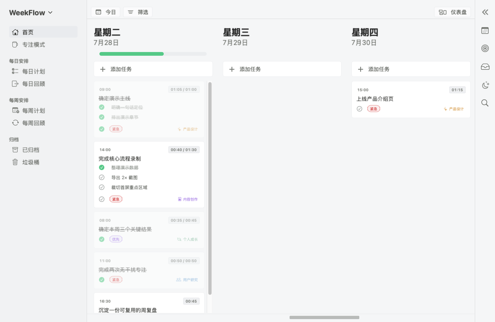
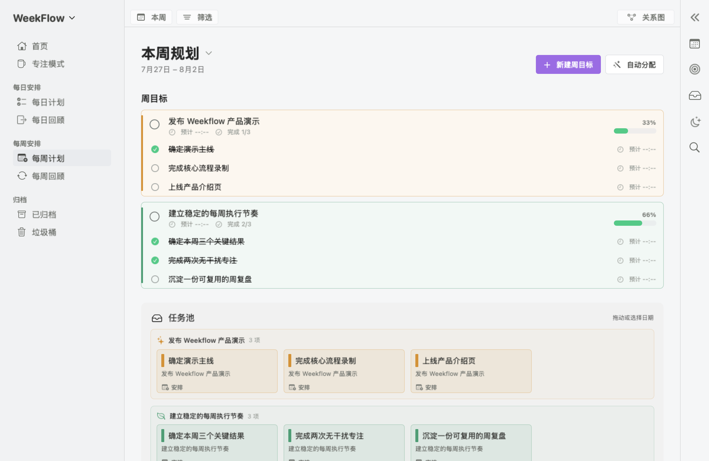
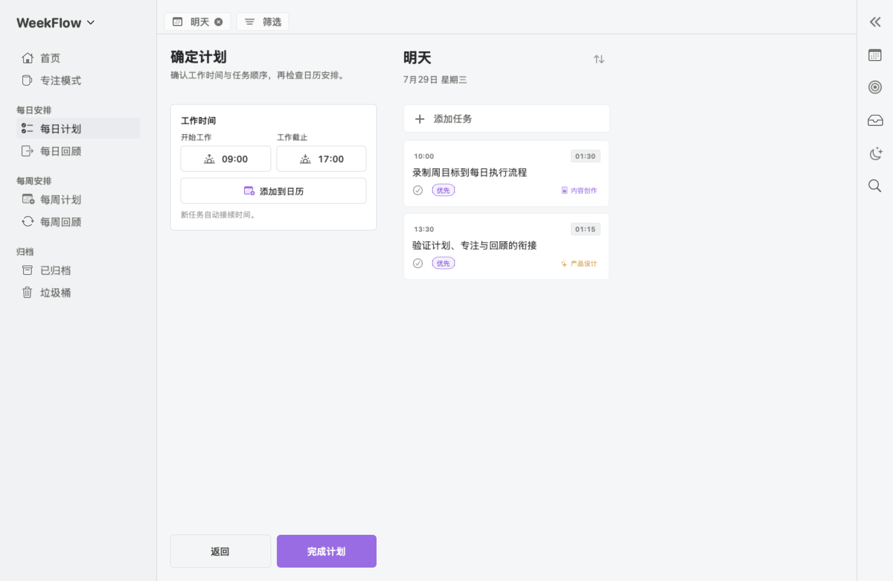
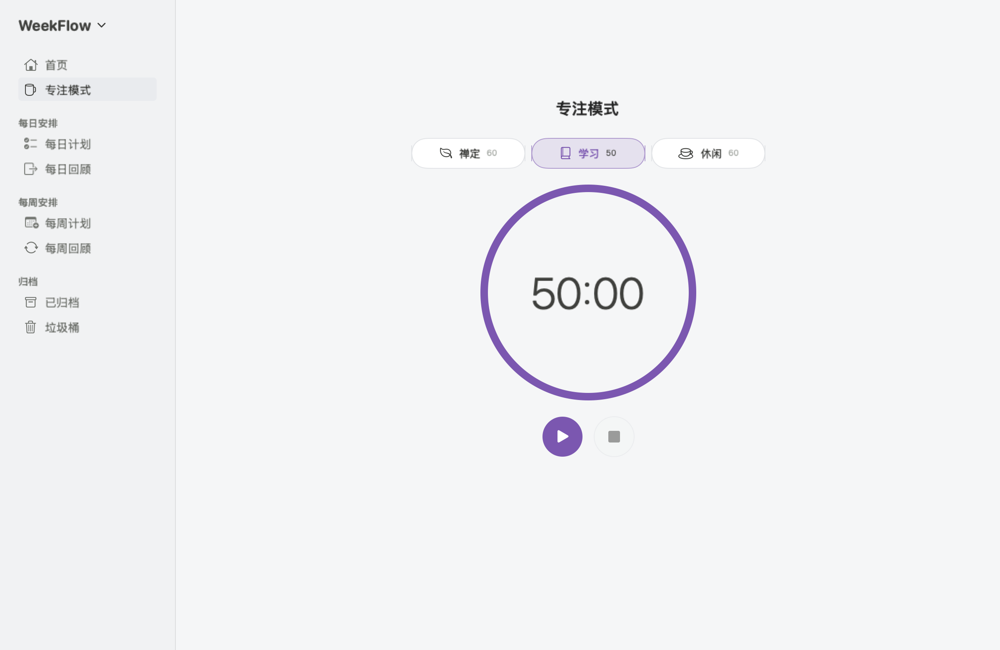
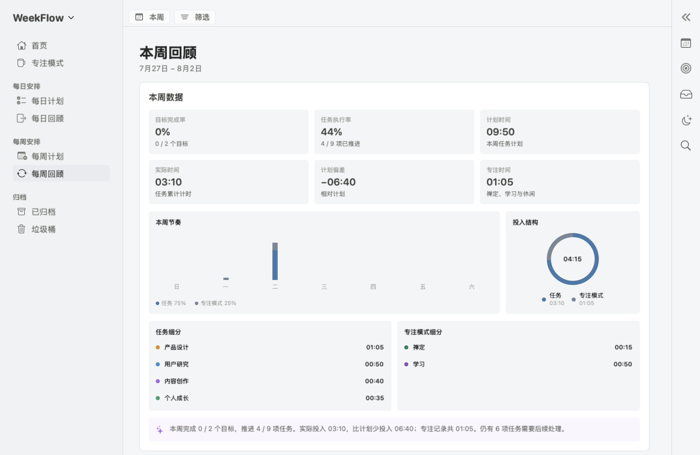

# Weekflow

**让一周，从目标走到完成。**

Weekflow 是一款由周目标驱动的原生 macOS 个人执行系统。它从本周真正重要的结果出发，把目标拆成任务、安排到每天，再用专注计时与每日、每周回顾形成完整闭环。

[在线演示](https://cgl-sd.github.io/weekflow/) · [下载最新版](https://github.com/cgl-sd/weekflow/releases/latest) · [隐私说明](PRIVACY.md)

`macOS 14+` · `Apple Silicon / Intel` · `本地优先` · `无需账号`

<p align="center">
  
</p>

## 一条完整的执行路径

**定下本周目标 → 拆成具体行动 → 安排到每一天 → 专注执行 → 每日与每周回顾**

Weekflow 不是把待办事项越列越长，而是让你始终看见：眼前这一步属于哪个周目标、今天实际投入了多少，以及这一周最终推进了什么。

## 主要功能

- **周目标规划**：建立目标和子目标，管理预计时间、完成数量、频道与进度。
- **任务池与每日分配**：手动拖拽或自动分配任务，并可撤销自动分配结果。
- **每日计划**：选择明日事项、设置截止时间，并在时间轴中安排任务。
- **专注执行**：记录任务实际投入，支持禅定、学习、休闲等专注模式。
- **每日与每周回顾**：查看任务完成、时间投入、频道分布和目标进度。
- **归档与恢复**：归档、垃圾桶和彻底删除具有明确边界，重要操作需要确认。

<table>
  <tr>
    <td width="50%" align="center">
      
    </td>
    <td width="50%" align="center">
      
    </td>
  </tr>
  <tr>
    <td align="center">周目标、任务池与每日分配</td>
    <td align="center">每日计划与时间轴</td>
  </tr>
</table>

<p align="center">
  
</p>

<p align="center">
  
</p>

## 系统要求

- macOS 14 或更高版本
- Apple Silicon 或 Intel Mac
- 不需要登录账号，不依赖云端服务

## 数据与隐私

Weekflow 本地优先，不包含广告、分析统计或遥测 SDK。

- 正式版数据保存在 macOS 沙盒目录 `~/Library/Containers/com.weekflow.app/Data/Library/Application Support/Weekflow`。
- DEBUG 构建只使用项目内的 `01_workspace/.data`，不会读取正式版数据；该目录不会提交到 Git。
- 安装包和 Git 仓库均不包含用户数据，首次运行时才创建本地存储。
- 只有用户主动点击“检查更新”时才连接 GitHub，且不会上传任务、计划或专注记录。
- 当前不接入 iCloud、系统日历、提醒事项或 AI API。
- 数据库升级前会生成可恢复备份；导入完整归档前会校验并备份现有数据。

完整说明见 [隐私说明](PRIVACY.md)。

## 开发

Weekflow 使用 Swift、SwiftUI、SwiftData 和 macOS 系统框架构建，没有第三方 Swift Package 运行时依赖。

```bash
cd 01_workspace
swift build
swift test
```

从仓库根目录构建并运行：

```bash
./script/build_and_run.sh
```

执行发布前本地验证：

```bash
./script/build_and_run.sh --verify
```

生成仅供本机测试的 ad-hoc ZIP 和 DMG：

```bash
./script/build_and_run.sh --package
```

正式公开发行还需要 Apple Developer ID 证书和公证凭据。发布脚本只允许从干净工作树和与 `VERSION` 完全一致的 Git 标签运行：

```bash
WEEKFLOW_DEVELOPER_ID="Developer ID Application: …" \
WEEKFLOW_NOTARY_PROFILE=weekflow-local \
./script/build_and_run.sh --release
```

## 版本

当前发布版本为 **Weekflow 1.0.3**，稳定产品基线从 **1.0.0** 开始递增；每版变化记录在 [RELEASE_NOTES.md](RELEASE_NOTES.md)。
