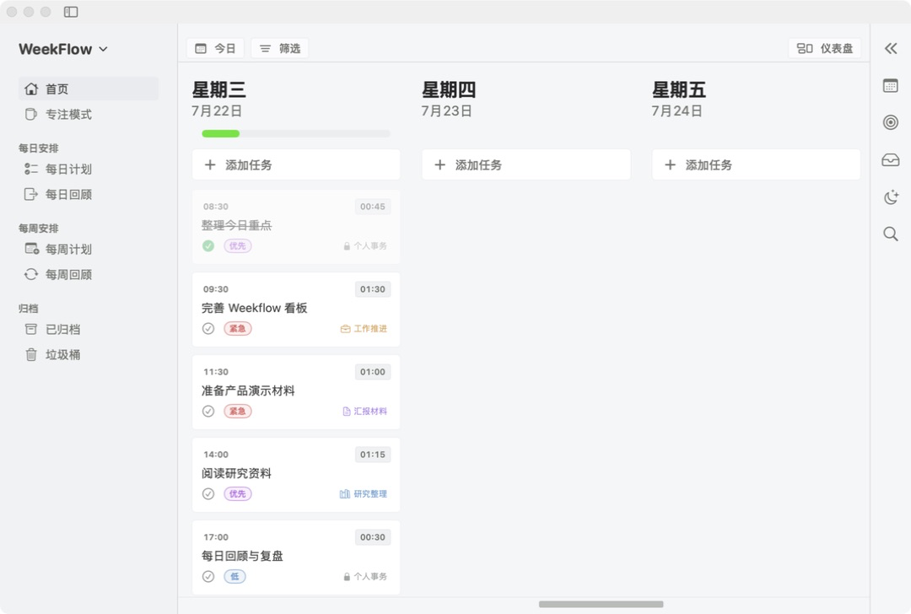
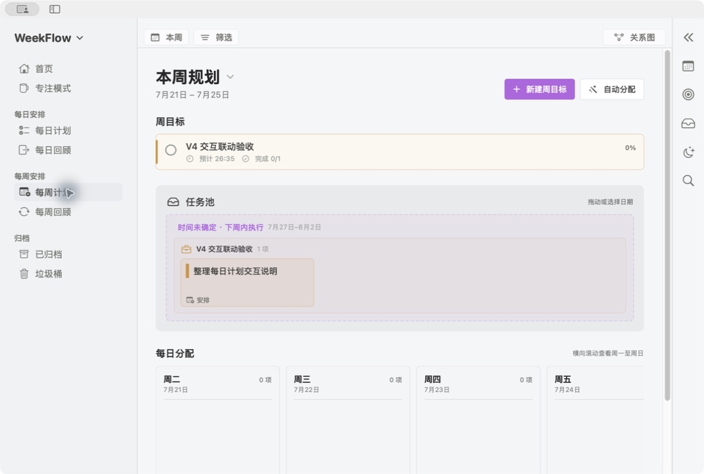
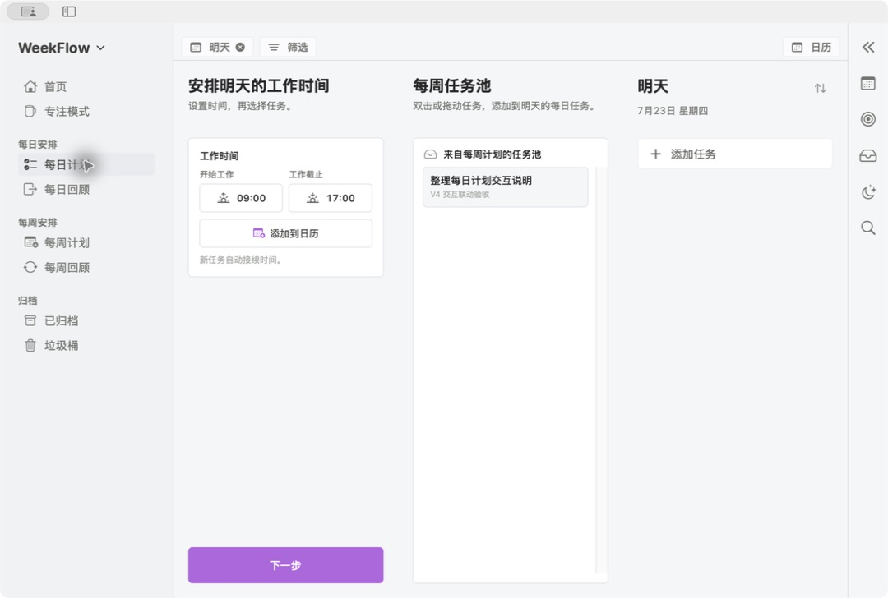
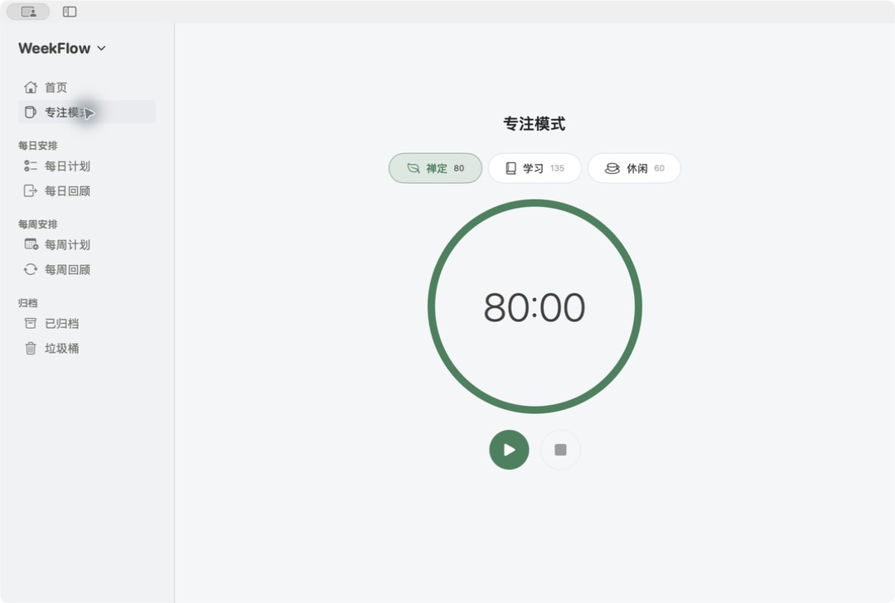

# Weekflow

**把一周真正想完成的事，变成每天可以执行的安排。**

[简体中文](README.md) · [English](README.en.md)

Weekflow 是一款原生 macOS 周计划与执行工具。它不从零散待办开始，而是先确定本周目标，再把子目标转化为任务池、分配到每天，并通过专注计时和回顾形成完整闭环。



## 支持什么

- **周目标规划**：建立周目标和子目标，统一管理预计时间、完成数量、频道和进度。
- **任务池与每日分配**：任务从周目标产生，可以手动安排、拖拽到具体日期，也可以自动分配并撤销本次结果。
- **每日计划**：从任务池选择明日事项，设置工作截止时间，并在同一页面查看日历时间轴。
- **日常执行**：按日期查看任务、安排开始时间、记录预计与实际投入，并通过 Channel 区分不同方向。
- **专注模式**：提供禅定、学习和休闲等专注方式，将专注时间纳入每日和每周统计。
- **每日与每周回顾**：查看任务完成、时间投入、频道分布和目标进度，决定归档或继续到下一周。
- **归档与垃圾桶**：归档和删除使用独立生命周期，内容可以恢复，彻底删除需要再次确认。

## 能形成什么效果

Weekflow 把“目标—任务—日期—投入—回顾”放在同一个数据链路中。周计划的分配结果会进入每日计划；每日新增的计划外任务不会反向污染周目标；完成状态、实际时间和专注记录会自动进入回顾统计。

<table>
  <tr>
    <td></td>
    <td></td>
  </tr>
  <tr>
    <td align="center">周目标 → 任务池 → 每日分配</td>
    <td align="center">选择明日事项并安排到时间轴</td>
  </tr>
</table>

## 一个典型案例

假设本周目标是“完成研究汇报”：

1. 建立“整理资料、形成框架、制作演示”三个子目标。
2. Weekflow 为子目标生成任务池卡片，并记录各自预计时间。
3. 把资料整理安排到周一、框架安排到周二、演示安排到周三；未安排任务可以自动分配到剩余日期。
4. 每天在首页执行任务，用专注模式记录实际投入。
5. 每日回顾当天结果；周末在每周回顾中查看计划与实际偏差，把未完成事项继续到下周或归档。

## 它的特点

- **目标驱动**：任务不是孤立条目，每项周任务都能追溯到目标或子目标。
- **两种周视图**：既可以使用分区视图管理内容，也可以用关系图理解目标、任务池与日期之间的联系。
- **数据一致**：首页、每日计划、每周计划和回顾读取同一份任务记录，避免多处副本互相冲突。
- **操作可恢复**：自动分配支持撤销；归档、垃圾桶与彻底删除拥有明确边界。
- **原生与本地优先**：使用 SwiftUI 和 SwiftData 构建，数据保存在本机，不依赖外部服务。
- **可自定义**：支持频道颜色、主题色、进度条颜色、图表配色和任务卡片显示偏好。

## 专注模式



专注记录会和任务实际时间、每日回顾及每周回顾联动，但不同专注模式仍保留各自独立的时长记录。

## 系统与数据

- 支持 macOS 14 或更高版本。
- 用户数据保存在本机 `Application Support/Weekflow`。
- Release 安装包不包含用户数据；首次运行时才会在本机创建数据存储。
- 当前不接入 iCloud、Apple Calendar、Reminders 或外部 AI API。
- 计划日、每日总结和周边界以无时区业务日期保存，旅行或切换系统时区不会改写原安排。
- SwiftData 数据库升级前会创建可恢复备份；损坏或迁移失败时应用进入只读保护，而不是用空数据覆盖原库。

## 下载

从 [GitHub Releases](https://github.com/cgl-sd/weekflow/releases/latest) 下载最新的 macOS DMG 或 ZIP。正式发布产物使用 Developer ID、Hardened Runtime 和 Apple 公证，并附带 `SHA256SUMS`；打开 DMG 后将 `Weekflow.app` 拖入“应用程序”文件夹即可。

## 开发构建

```bash
cd 01_workspace
swift build
swift test
```

构建并启动应用：

```bash
./script/build_and_run.sh
```

生成仅供本机验证的 ad-hoc 预览 ZIP 与 DMG：

```bash
./script/build_and_run.sh --package
```

正式发布使用 CI secrets 中的 Developer ID 与公证凭据，由 tag workflow 执行：

```bash
WEEKFLOW_DEVELOPER_ID="Developer ID Application: …" \
WEEKFLOW_NOTARY_PROFILE=weekflow-ci \
./script/build_and_run.sh --release
```
